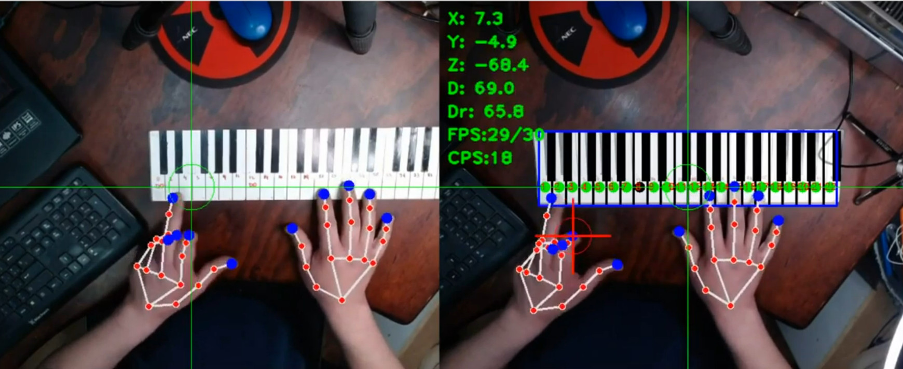

# virtualpiano keyboard

## Demo YouTube:

## Introducción
Implementación de un Teclado Virtual para Piano utilizando Visión Estéreo con un modelo de detección de manos y fluidsynth

## Instalación

Esto está integrado en un ambiente Python 3.8 con virtual environment (venv)

Se recomienda utilizar un ambiente virtual, por ejemplo:

  $ python3.8 -m venv ve_py38_virtualpiano

  $ source ve_py38_virtualpiano/bin/activate

  $ python -m pip install --requirement requirements.txt

## Ejecución
El programa no tiene parámetros de entrada (por ahora) y asume que las cámaras son los devices 2 y 0 (Cámaras mirando en frente de sus manos) 

  $ python src/virtualpianokb.py 

## Cámaras
Para la visión estéreo integré un par de cámaras "Logi HD Pro Webcam C920"

## Licencia
Este proyecto está bajo la Licencia "MIT License" - mira el archivo [LICENSE.md](LICENSE.md) para detalles

## Pendientes
*TODO 1*: Incluir el diagrama de las cámaras

*TODO 2*: Documentar el proceso de calibración de las cámaras
