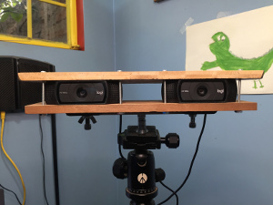

# virtualpianokb
Implementación de un Teclado Virtual para Piano utilizando Vision Estereo con un modelo de detección de manos y fluidsynth

Esto está integrado en un ambiente python 3.8 con virtual environment (venv)
Para la camara stereo integré un par de camaras Logi HD Pro Webcam C920

TODO 1: Incluir el diagrama de las camaras

TODO 2: Documentar el proceso de calibracion de las camaras
